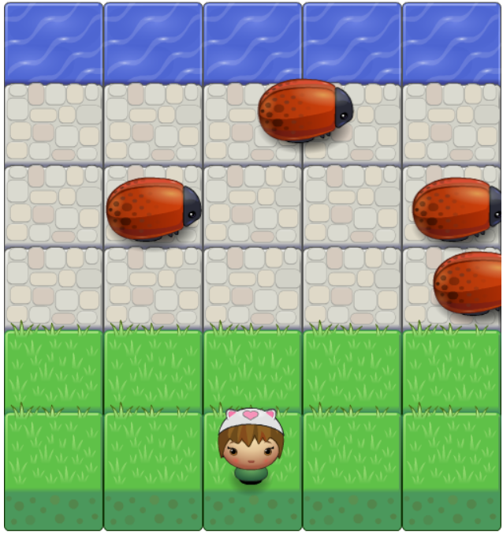

Frontend-NanoDegree Arcade Game
===============================
## How to run the game in your PC?

1. Click 'Clone or downloaded' button and click 'DOWNLOAD ZIP' to download the project in your PC. 

2. Open the folder, click 'index.html' to run the game

## Game Instruction

Control the player by pressing up, down, left and right keyboards

Avoid the bugs and reach the river to win the game :)

